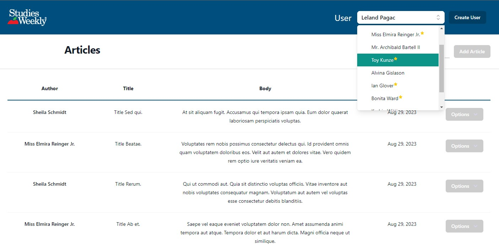

# Studies Weekly Coding Challenge - Article CMS
 A simple Content Management System (CMS) for educational articles. Create, read, update and delete articles from a database.<br><br>

## Overview

Built using PHP Laravel for the backend and Vue 3 on the frontend, this project demonstrates my ability to setup RESTful API endpoints where a user can perorm CRUD operations to interact   with and modify content in a MySQL database. 

## App Functionallity
Interacting with the application should be pretty straight forward, the only view is a dashboard that displays all articles saved in the database. Here are some of the keypoints of the application:
1. **User Permissions**:
  Basic user permissions that will either allow or block access to interacting with the API. <br>
  There are 2 user types:<br>
  <br>**⭐Admin Users** - have edit access and can create, delete, and update articles.  Admin users have a star by their name in the User dropdown. <br>
  <br>**Read Only Users** - Any user that doesn't have the star is a Non-Admin user, or Read-Only user. They can see and search all the articles, but will get blocked if they try to interact with the API.<br><br>
2. **Search by Title** 🔎 : <br>
The search bar in the dashboard allows you to search by title to find articles easier.

# Setup

## Docker Setup
Docker setup will require a Unix terminal and having Docker running.  Docker download instructions [here](https://www.docker.com/get-started/)<br><br> 
Both the frontend and backend have a makefile to run all necessary commands to setup the docker containers and development environment for the application.<br><br>
Starting at the root of the project, execute the following:
1. Frontend
   <br>
   ```
   cd frontend
   make setup
   ```
2. Backend
   <br>
   ```
   cd backend
   make setup
   ```
   Doing this will setup everything necessary to run the project, including the MySQL database in a docker container.

### Docker Testing
To run unit tests for the docker image, execute the following:
```
cd backend
make test
```
#### Docker Sidenote
If you decide to setup with docker, you will not need to add .env files or modify them at all. Even though it is not good practice, for simplicity in sharing and setup for this project, I included the .env files with the needed docker variables in the repository. If the make command does not work, feel free to look at the make files and run each command in sequence in the terminal, this should allow everything to work even if the make command has errors. 

## Local Setup
The following prerequisites are required for this project:
* MySQL: >= v8.0.31
* node: >= v16.17.1
* php: >= v8.1.10
* composer: >= v2.4.3

If there are issues with setup, please verify that you have these installed and that the version is up to date.
    
### Database Setup:

This project requires a MySQL database setup for storage of the Articles/Users. Set up a MySQL database by following the instructions [here](https://dev.mysql.com/doc/mysql-getting-started/en/).

### Frontend Setup:

1. Install Dependencies
```
npm install
```
2. Create .env using .env.example file and include api endpoint.
   Laravel defaults to port 8000, but if you configured your backend to run on a different port, update this variable accordingly.
```
VITE_APP_API_ENDPOINT=http://localhost:8000/api
```
3. Start development server for the frontend
```
npm run dev
```
### Backend Setup:

1. Install Dependencies
```
composer install
```
2. Create .env file using .env.example in backend folder
update the database configuration so that it is configured to your MySQL Database.
```
DB_CONNECTION=mysql
DB_HOST={YOUR_HOST}
DB_PORT={YOUR_PORT}
DB_DATABASE={YOUR_DATABASE}
DB_USERNAME={YOUR_USERNAME}
DB_PASSWORD={YOUR_PASSWORD}
```
3. Migrate Database
```
php artisan migrate:fresh
```
4. Seed Database
```
php artisan db:seed
```
5. Start Laravel development server
```
php artisan serve
```
## Testing
For testing, the project uses a SQLite in-memory database and Laravel's built in testing structure to do feature tests on each of the API endpoints for the project.

To run tests: 
```
php artisan test
```

## API Routes Overview

This API provides various endpoints to interact with the application's resources. Below is a summary of the available routes and their basic functions:

### Users

- `GET /api/users`
  - Retrieve a list of all users.

- `POST /api/users`
  - Create a new user.

### Articles

- `GET /api/articles`
  - Retrieve a list of all articles.

- `GET /api/articles/{id}`
  - Retrieve details of a specific article.

- `POST /api/articles`
  - Create a new article.

- `PUT /api/articles/{id}`
  - Update information of a specific article.

- `DELETE /api/articles/{id}`
  - Delete an article.

Each route is designed to handle specific CRUD (Create, Read, Update, Delete) operations for corresponding resources.


